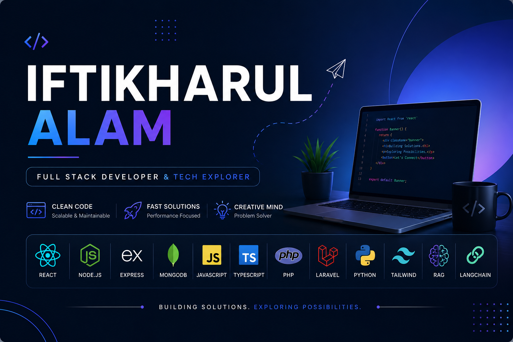

<h1 align="center">Hi 👋, I'm Iftikharul Alam</h1>
<h3 align="center">
🚀 Full Stack Developer | MERN, Laravel & AI Engineer | RAG & LangChain Explorer
</h3>
<!-- <h3 align="center">🚀 Full Stack Developer | MERN Stack Enthusiast | Tech Explorer from Bangladesh</h3> -->

  

---
👨‍💻 About Me
🔭 I’m currently working at Programming Hero
🌱 I’m currently deep diving into MERN Stack, Laravel, RAG & AI Applications
💬 Ask me about: React, Node.js, PHP, Laravel, Python, REST APIs, LangChain, RAG
🤖 Exploring LLM-powered applications, Retrieval-Augmented Generation (RAG), and AI Automation
📫 Reach me at: iftikharalam.shimul@outlook.com
📄 View My Resume

---

### 🌐 Connect With Me

                        
                        
                        
                        
                    

---

### 💻 Tech Stack

  

---

### 📈 GitHub Stats

  

  

---

### 🏆 GitHub Trophies

  

